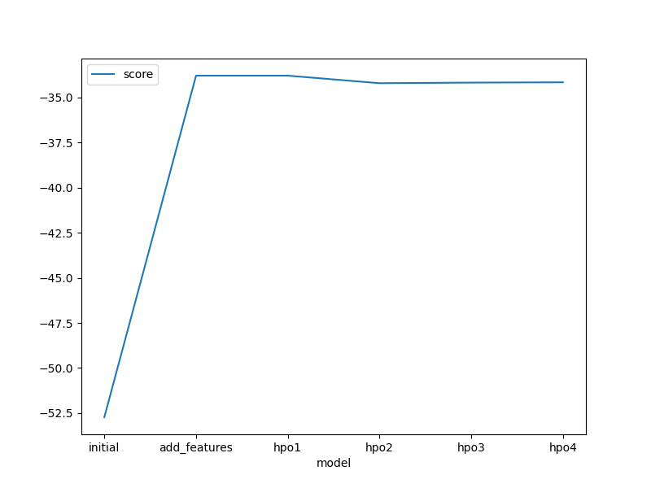

# Report: Predict Bike Sharing Demand with AutoGluon Solution
#### Phil Kim

## Initial Training
### What did you realize when you tried to submit your predictions? What changes were needed to the output of the predictor to submit your results?
That the number of rows the competition was expecting was 6493 and that all values were to be zero or greater.

### What was the top ranked model that performed?
The weightedensemble_L3 was the top ranked model for the initial dataset, the new features dataset and hpo1 and the weightedensemble_L2 was the top ranked model for hpo2, hpo3 and hpo4.

## Exploratory data analysis and feature creation
### What did the exploratory analysis find and how did you add additional features?
The EDA found that the temp ranged between 0 and 40 and most of the counts were around 20, most of the humidity counts were above 40, most of the windspeed counts were between 0 and 25 with most of the counts around 10 to 15. Additional features added were the month, day and hour as well as changing the season and weather to categories.

### How much better did your model perform after adding additional features and why do you think that is?
The top ranking model did perform better than the initial dataset from -52.730 to -33.788 and that's probably due to the season and weather being changed to a category as opposed to a value.

## Hyper parameter tuning
### How much better did your model perform after trying different hyper parameters?
While tuning the hyperparameters for the 4 hpo's, I found that the top ranking model had changed from weightedensemble_L3 to weightedensemble_L2. However, the scores for the top ranking models didn't changed much as well as the kaggle scores.

### If you were given more time with this dataset, where do you think you would spend more time?
I would try individually tuning the top ranked models to get better performance.

### Create a table with the models you ran, the hyperparameters modified, and the kaggle score.
|model|Trials|eval_metric|time_limit|presets|score|
|--|--|--|--|--|--|
|initial|N/A|rmse|600|best_quality|1.84007|
|add_features|N/A|rmse|600|best_quality|0.6538|
|hpo1|5|rmse|600|best_quality|0.6538|
|hpo2|5|rmse|600|none|0.5417|
|hpo3|5|rmse|1200|none|0.5543|
|hpo4|10|rmse|1200|none|0.5573|

### Create a line plot showing the top model score for the three (or more) training runs during the project.

### Create a line plot showing the top kaggle score for the three (or more) prediction submissions during the project.

## Summary

During the course of this project adjustments were made to the dataset and the hyperparameters of AutoGluon ( an opensource autoML framework ) to train and make predictions. Adjustments to the dataset included adding features by breaking out the datetime column into month, day and hour columns and changing 2 columns from an integer to a category. However after making changes to the dataset the results showed improvement in regards to the score of the top ranking model, but the score from kaggle decreased compared to the initial dataset. Changing the hyperparameters of the TabularPredictor function of AutoGluon seemed to not make much difference compared to the score of the new features dataset. After evaluating the results from this project I would conclude that spending time tuning the hyperparameters is not a worthwhile approach to improving performance. If there were more time to spend, I believe trying to tune the individual models would be an avenue to pursue to achieve improved kaggle scores.
